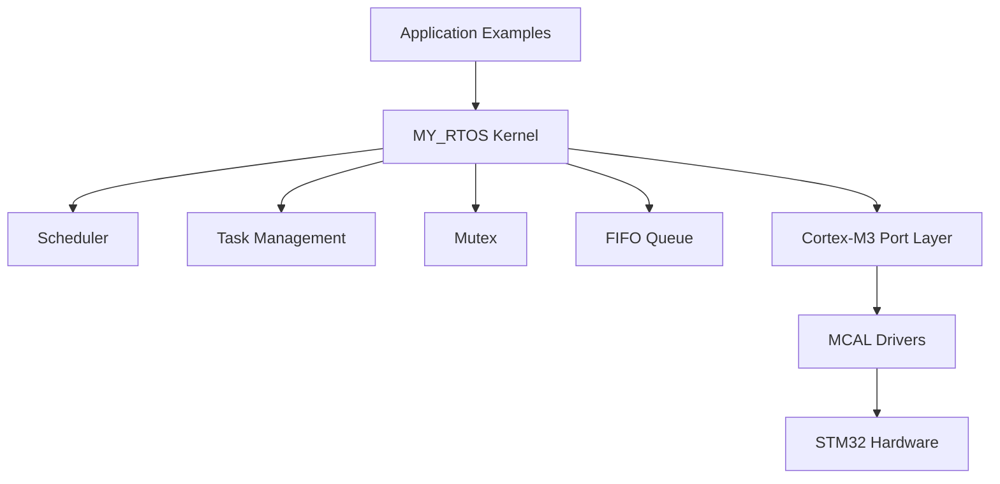
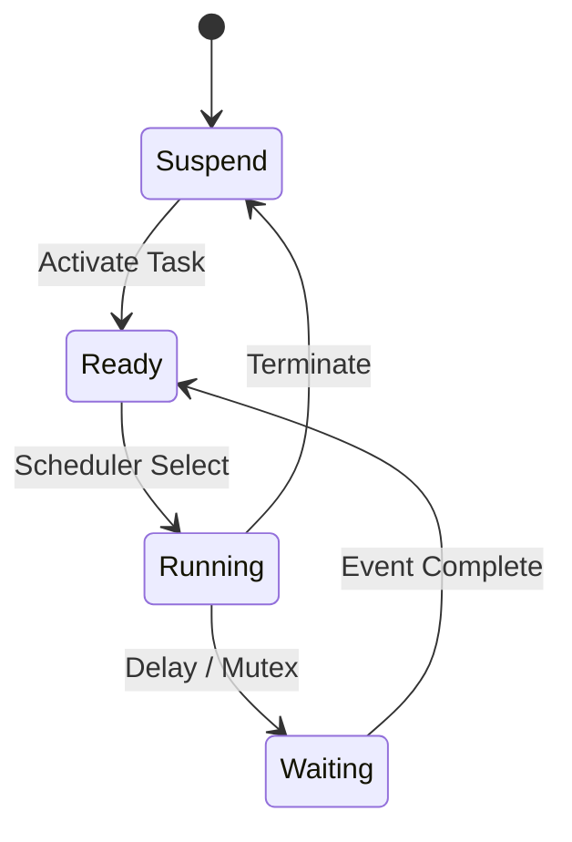
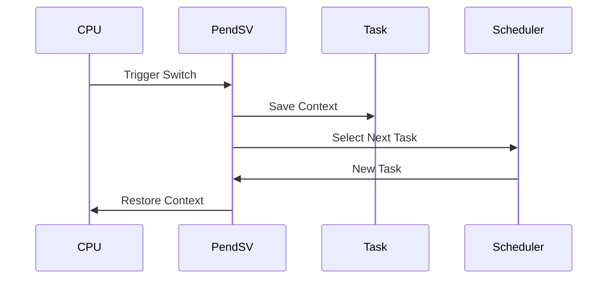
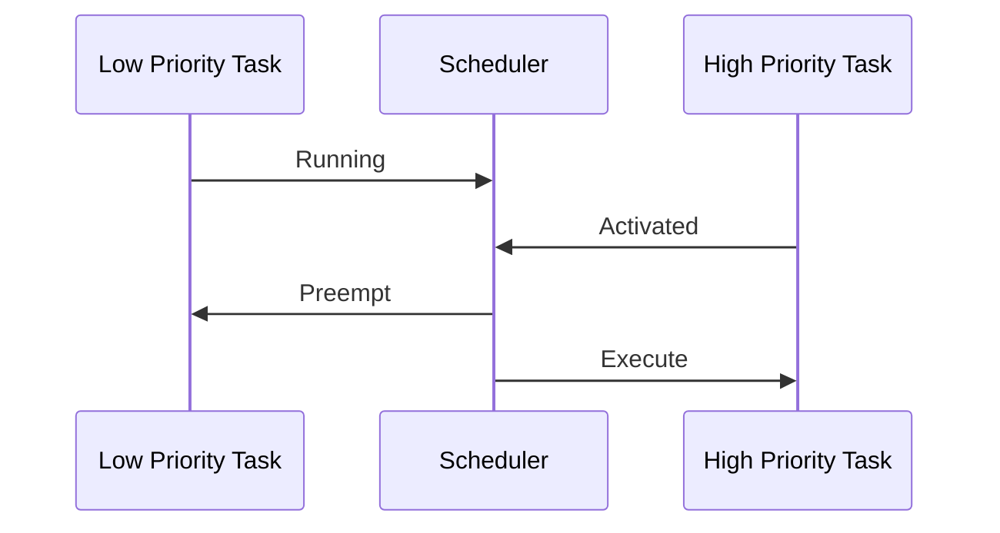
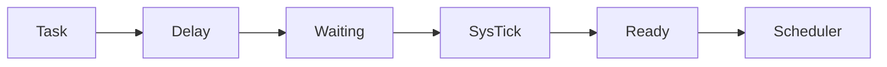
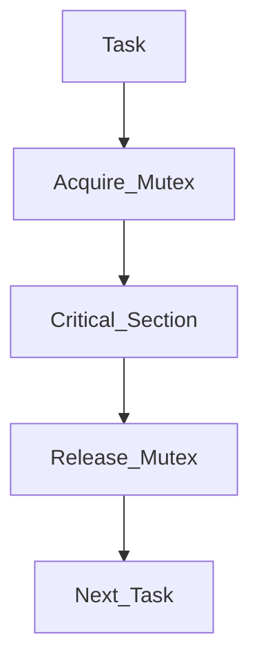

# Custom-RTOS

[](https://github.com/Mahmoud976/Custom-RTOS/releases/tag/v1.0.0)

[](LICENSE)

## Overview

Custom-RTOS is a lightweight educational RTOS kernel designed for ARM Cortex-M3 based systems.

---
# Custom RTOS Kernel for ARM Cortex-M3
A lightweight Real-Time Operating System (RTOS) developed from scratch for ARM Cortex-M3.

This project demonstrates the internal concepts of RTOS design including:

* Task Management
* Context Switching
* Priority Scheduling
* Round Robin Scheduling
* Task Waiting / Delay
* Mutex Synchronization
* FIFO Communication

---

# Project Architecture



---

# Kernel Features

## Task Management

The RTOS supports creating multiple tasks with:

* Independent stack
* Priority level
* Task state management
* Scheduler integration

Task Flow:



---

# Context Switching

The RTOS uses ARM Cortex-M exception mechanisms:

* PendSV for context switching
* SVC for kernel services
* PSP for task stack handling

Context Switching:



---

# Examples

All RTOS features are tested through separated examples.

```
Examples

├── Priority Example
├── Priority Preemption Example
├── RoundRobin Example
├── TaskWaiting Example
├── Mutex Example
└── FIFO Example
```

---

# Priority Example

Demonstrates basic priority based scheduling.

Higher priority tasks are selected first.

Example:

```
Priority 1  -> Low Task
Priority 3  -> Medium Task
Priority 5  -> High Task
```

Scheduler selects the smallest priority value first according to the kernel implementation.

---

# Priority Preemption Example

Demonstrates preemption when a higher priority task becomes ready.

Flow:



---

# Round Robin Example

Demonstrates CPU sharing between tasks having the same priority.

Example:

```
Task A
Task B
Task C


Execution:

A -> B -> C -> A -> B -> C
```

---

# Task Waiting Example

Uses:

```c
MY_RTOS_Task_Wait()
```

Allows tasks to sleep for a specific number of OS ticks.

Flow:



---

# Mutex Example

Demonstrates resource protection between multiple tasks.

Used to prevent multiple tasks accessing the same resource simultaneously.

Mutex Flow:



---

# FIFO Example

Standalone FIFO driver implementation.

Features:

* Enqueue
* Dequeue
* Full detection
* Empty detection
* Circular buffer handling

Structure:

```
+----+----+----+----+
|    |    |    |    |
+----+----+----+----+

 ^
 Head

 ^
 Tail
```

---

# Project Structure

```
STM32

├── Kernel
│
│   ├── Src
│   │   ├── scheduler.c
│   │   └── RTOS_FIFO.c
│   │
│   └── inc
│       ├── scheduler.h
│       └── RTOS_FIFO.h
│

├── Port
│   ├── CortexMx_OS_Porting.c
│   └── CortexMx_OS_Porting.h
│

├── MCAL
│   ├── GPIO Driver
│   └── Interrupt Driver
│

├── Examples
│   ├── Priority Example
│   ├── Priority Preemption Example
│   ├── RoundRobin Example
│   ├── TaskWaiting Example
│   ├── Mutex Example
│   └── FIFO Example
│

└── main.c
```

---

# Hardware

Target MCU:

* STM32F103C6
* ARM Cortex-M3

Development Tools:

* STM32CubeIDE
* GNU Arm Embedded Toolchain

---

# Future Improvements

Planned features:

* Priority Inheritance for Mutex
* Message Queue
* Event Flags
* Dynamic Memory Management
* Support for more Cortex-M devices

---
# RTOS API

The following APIs are provided by **Custom-RTOS** to create and manage
tasks, handle synchronization, communicate using FIFO queues, and
control the scheduler.

------------------------------------------------------------------------

# Kernel Initialization

## MY_RTOS_Init()

Initializes the RTOS kernel.

Responsibilities:

-   Create the Main Stack.
-   Initialize the Ready Queue.
-   Create the Idle Task.
-   Prepare the Scheduler.

Example:

``` c
if(MY_RTOS_Init() != NO_ERROR)
{
    while(1);
}
```

------------------------------------------------------------------------

# Task Management

## MY_RTOS_Create_Task()

Creates a new task and initializes its private stack.

Prototype:

``` c
MY_RTOS_Error_ID MY_RTOS_Create_Task(Task_ref* Tref);
```

Example:

``` c
Task1.Stack_Size = 1024;
Task1.P_Task_Entry = Task_Function;
Task1.priority = 1;

MY_RTOS_Create_Task(&Task1);
```

------------------------------------------------------------------------

## MY_RTOS_Activate_Task()

Activates a task and allows the scheduler to select it for execution.

Prototype:

``` c
void MY_RTOS_Activate_Task(Task_ref* Tref);
```

Example:

``` c
MY_RTOS_Activate_Task(&Task1);
```

------------------------------------------------------------------------

## MY_RTOS_Terminate_Task()

Terminates the current task execution and returns control to the
scheduler.

Prototype:

``` c
void MY_RTOS_Terminate_Task(Task_ref* Tref);
```

Example:

``` c
MY_RTOS_Terminate_Task(&Task1);
```

------------------------------------------------------------------------

# Task Waiting / Delay

## MY_RTOS_Task_Wait()

Blocks a task for a specific number of OS ticks.

Prototype:

``` c
void MY_RTOS_Task_Wait(
        unsigned int NoTICKS,
        Task_ref* SelfTref);
```

Example:

``` c
MY_RTOS_Task_Wait(1000, &Task1);
```

------------------------------------------------------------------------

# Mutex Synchronization

## MY_RTOS_Acquire_Mutex()

Acquires ownership of a mutex resource.

If the mutex is already owned by another task, the requesting task
enters the waiting state.

Prototype:

``` c
MY_RTOS_Error_ID MY_RTOS_Acquire_Mutex(
        Mutex_ref* Mref,
        Task_ref* Tref);
```

Example:

``` c
MY_RTOS_Acquire_Mutex(&MUTEX1, &Task1);
```

------------------------------------------------------------------------

## MY_RTOS_Release_Mutex()

Releases the mutex resource.

Prototype:

``` c
void MY_RTOS_Release_Mutex(
        Mutex_ref* Mref);
```

Example:

``` c
MY_RTOS_Release_Mutex(&MUTEX1);
```

------------------------------------------------------------------------

# FIFO Queue API

The RTOS provides a FIFO queue implementation based on a circular
buffer.

Features:

-   Queue Initialization
-   Enqueue
-   Dequeue
-   Full detection
-   Empty detection

------------------------------------------------------------------------

## Queue_Init()

Initializes a FIFO queue.

Prototype:

``` c
Queue_Status Queue_Init(
        Queue_t* queue,
        Task_ref** buffer,
        unsigned int size);
```

------------------------------------------------------------------------

## Queue_Enqueue()

Adds an item to the FIFO queue.

Prototype:

``` c
Queue_Status Queue_Enqueue(
        Queue_t* queue,
        Task_ref* item);
```

------------------------------------------------------------------------

## Queue_Dequeue()

Removes an item from the FIFO queue.

Prototype:

``` c
Queue_Status Queue_Dequeue(
        Queue_t* queue,
        Task_ref** item);
```

------------------------------------------------------------------------

# Scheduler Control

## MY_RTOS_START_OS()

Starts the RTOS scheduler.

Prototype:

``` c
void MY_RTOS_START_OS(void);
```

Example:

``` c
MY_RTOS_START_OS();
```

------------------------------------------------------------------------

# Application Flow Example

``` c
int main(void)
{
    HW_Init();

    MY_RTOS_Init();

    MY_RTOS_Create_Task(&Task1);
    MY_RTOS_Create_Task(&Task2);

    MY_RTOS_Activate_Task(&Task1);
    MY_RTOS_Activate_Task(&Task2);

    MY_RTOS_START_OS();
}
```

Flow:

    HW_Init()

        |

    MY_RTOS_Init()

        |

    Create Tasks

        |

    Activate Tasks

        |

    Start Scheduler

        |

    Context Switch

------------------------------------------------------------------------

# Supported Features

-   Task Creation
-   Task Activation and Termination
-   Priority Based Scheduling
-   Priority Preemption
-   Round Robin Scheduling
-   Task Delay / Waiting
-   Mutex Synchronization
-   FIFO Queue Management
-   ARM Cortex-M3 Context Switching
-   SVC Kernel Services
-   PendSV Based Context Switching


---

# Author

Mahmoud Saleh

Embedded Systems Engineer

# License
MIT


