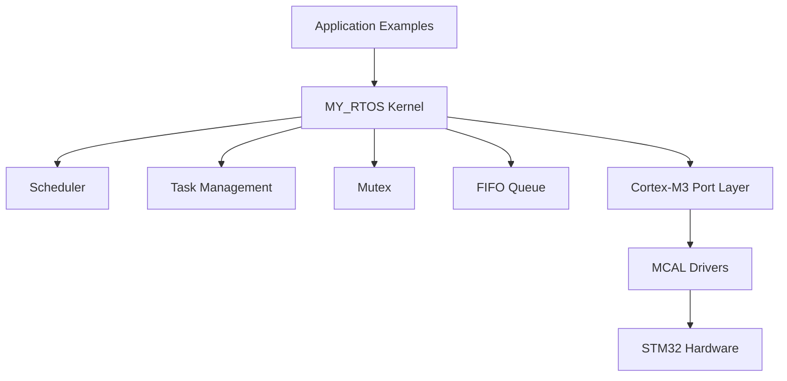
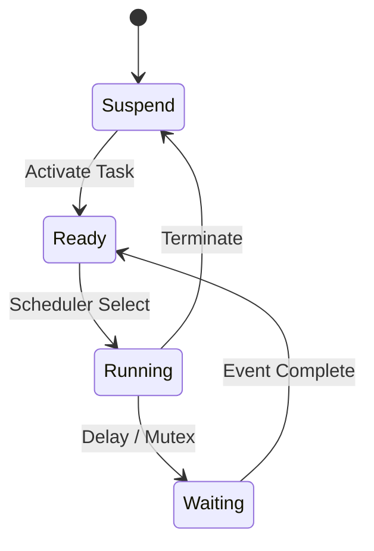
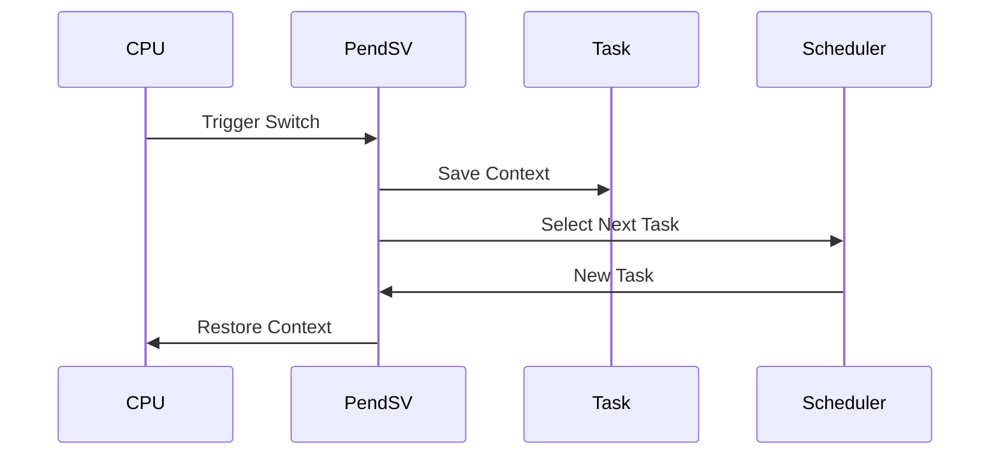
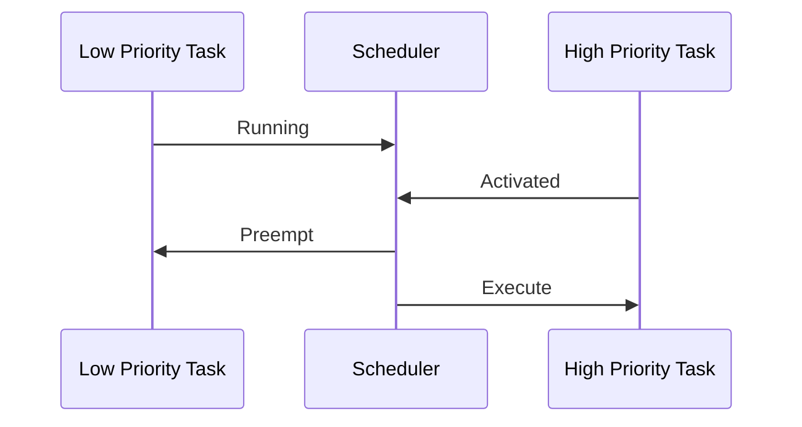
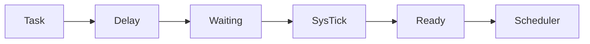
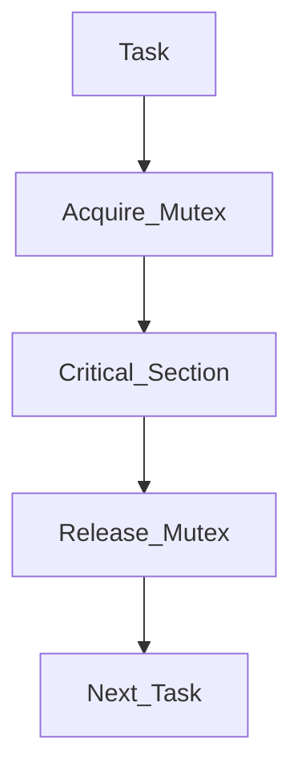

# Custom RTOS Kernel for ARM Cortex-M3

A lightweight Real-Time Operating System (RTOS) developed from scratch for ARM Cortex-M3.

This project demonstrates the internal concepts of RTOS design including:

* Task Management
* Context Switching
* Priority Scheduling
* Round Robin Scheduling
* Task Waiting / Delay
* Mutex Synchronization
* FIFO Communication

---

# Project Architecture



---

# Kernel Features

## Task Management

The RTOS supports creating multiple tasks with:

* Independent stack
* Priority level
* Task state management
* Scheduler integration

Task Flow:



---

# Context Switching

The RTOS uses ARM Cortex-M exception mechanisms:

* PendSV for context switching
* SVC for kernel services
* PSP for task stack handling

Context Switching:



---

# Examples

All RTOS features are tested through separated examples.

```
Examples

├── Priority Example
├── Priority Preemption Example
├── RoundRobin Example
├── TaskWaiting Example
├── Mutex Example
└── FIFO Example
```

---

# Priority Example

Demonstrates basic priority based scheduling.

Higher priority tasks are selected first.

Example:

```
Priority 1  -> Low Task
Priority 3  -> Medium Task
Priority 5  -> High Task
```

Scheduler selects the smallest priority value first according to the kernel implementation.

---

# Priority Preemption Example

Demonstrates preemption when a higher priority task becomes ready.

Flow:



---

# Round Robin Example

Demonstrates CPU sharing between tasks having the same priority.

Example:

```
Task A
Task B
Task C


Execution:

A -> B -> C -> A -> B -> C
```

---

# Task Waiting Example

Uses:

```c
MY_RTOS_Task_Wait()
```

Allows tasks to sleep for a specific number of OS ticks.

Flow:



---

# Mutex Example

Demonstrates resource protection between multiple tasks.

Used to prevent multiple tasks accessing the same resource simultaneously.

Mutex Flow:



---

# FIFO Example

Standalone FIFO driver implementation.

Features:

* Enqueue
* Dequeue
* Full detection
* Empty detection
* Circular buffer handling

Structure:

```
+----+----+----+----+
|    |    |    |    |
+----+----+----+----+

 ^
 Head

 ^
 Tail
```

---

# Project Structure

```
STM32

├── Kernel
│
│   ├── Src
│   │   ├── scheduler.c
│   │   └── RTOS_FIFO.c
│   │
│   └── inc
│       ├── scheduler.h
│       └── RTOS_FIFO.h
│

├── Port
│   ├── CortexMx_OS_Porting.c
│   └── CortexMx_OS_Porting.h
│

├── MCAL
│   ├── GPIO Driver
│   └── Interrupt Driver
│

├── Examples
│   ├── Priority Example
│   ├── Priority Preemption Example
│   ├── RoundRobin Example
│   ├── TaskWaiting Example
│   ├── Mutex Example
│   └── FIFO Example
│

└── main.c
```

---

# Hardware

Target MCU:

* STM32F103C6
* ARM Cortex-M3

Development Tools:

* STM32CubeIDE
* GNU Arm Embedded Toolchain

---

# Future Improvements

Planned features:

* Priority Inheritance for Mutex
* Message Queue
* Event Flags
* Dynamic Memory Management
* Support for more Cortex-M devices

---

# Author

Mahmoud Saleh

Embedded Systems Engineer
